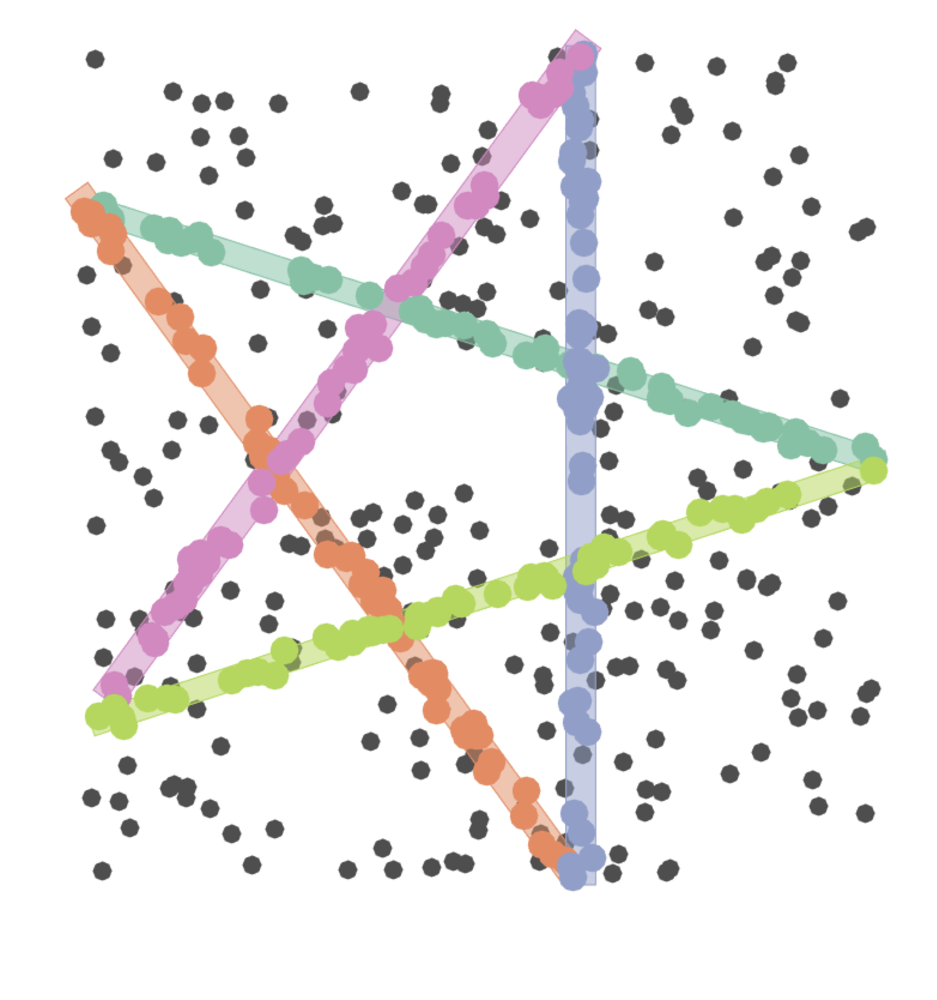
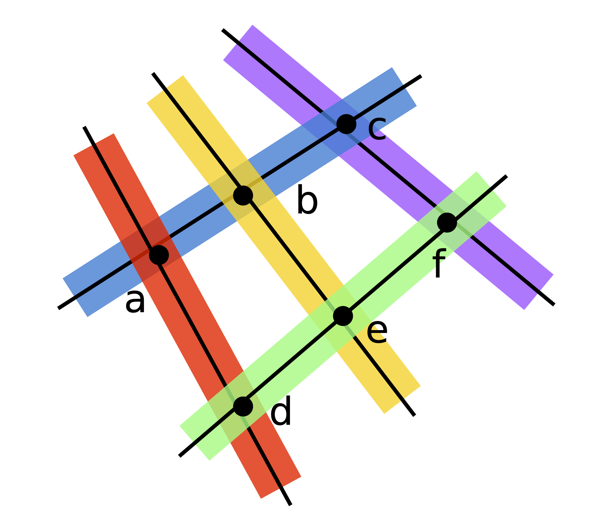
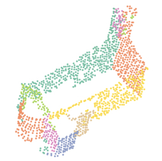

### parametric multi model fitting

fitting multiple instances of parametric models to data corrputed by noise and outliers

    

        <a href="http://www.diegm.uniud.it/fusiello/demo/jlk/">
        <!--

-->
        
        
            
Hierarchical clustering in Preference Space

        
        </a>
    

    

    <a href="http://www.diegm.uniud.it/fusiello/demo/jlk/"><strong>T-linkage</strong></a>
    

    

        <a href="http://www.diegm.uniud.it/fusiello/demo/rpa/">
         
        
            
Robust Matrix Factorization in Preference Space

        
        </a>
    

    

    <a href="http://www.diegm.uniud.it/fusiello/demo/rpa/"><strong>Robust Preference Analysis</strong></a>
    

    

        <a href="http://www.diegm.uniud.it/fusiello/demo/cov/">
        
        
            
Set cover formulation

        
        </a>
    

    

    <a href="http://www.diegm.uniud.it/fusiello/demo/cov/"><strong>Random Sample Coverage</strong></a>
    

    

        <a href="http://www.diegm.uniud.it/fusiello/demo/scan2bim/">
         
        
            
J-linlkage with min-hash for scan2bim

        
        </a>
    

    

     <a href="http://www.diegm.uniud.it/fusiello/demo/scan2bim/"><strong>Scan2Bim with J-linkage</strong></a>
    

    

        <a href="http://www.dpia.uniud.it/fusiello/demo/mct/">
         
        
            
Dealing with models of different classes 

        
        </a>
    

    

    <a href="http://www.dpia.uniud.it/fusiello/demo/mct/"><strong> Cascaded T-Linkage</strong></a>
    

<!--

Many tasks in empirical sciences, including Computer Vision, can be formulated in terms of robust estimation of multiple parametric models that fit data corrupted by noise and outliers (e.g. two view segmentation, primitive fitting)
This is a thorny “chicken-&-egg dilemma”: to estimate models one needs to first partition the data, and to partition the data it is necessary to know which model points belong to. According to which horn of this dilemma is addressed first, two main approaches can be singled out, namely consensus and preference analysis.

[1, 2] concentrates on representation of preferences and  provides a general framework  in which M-estimator are employed to robustly depict data preferences.  
In [3], density-based techniques are used to analyze the geometry of the conceptual space and to guide random sampling towards promising tentative model hypotheses.
The specification of the inlier threshold is a key ingredient for correctly depict point preferences, [4] addresses this issue and presents a method to automatically select the inlier threhsold. In [4] the case of models belonging to multiple classe is considered in a cascaded framework.

As the segmentation is concerned, two main directions are explored: spectral analysis and set cover problems.
Following the way of spectral clustering,[5] studies the connections of this algorithm with low-rank approximation techniques, to revisit this scheme enforcing robustness: the eigen-decomposition step is replaced by Robust Principal Component Analysis on a pairwise affinity matrix, and Symmetric Non-Negative Matrix Factorization played the role of $k$-means. In this way, the chicken-\&-egg dilemma is reduced to many single-fitting problems that can be  solved with the help of robust statistics.
 
[6] traces  the connection between the problem of multi-model fitting and set covering problem. Exploiting  the discrete approach proposed by J-Linkage in which preferences are expressed by binary votes, the pool of tentative models defines a covering of the data  whose elements are the consensus sets of the instantiated hypotheses. The problem of estimating models can hence be translated in finding  minimal or optimal coverings.

#### References

* 
*
*
-->

<!--





    

        <a href="{{ project.redirect }}" target="_blank">
        
        
        
        

            
        
            <h1>{{ project.title }}</h1>
             
            
{{ project.description }}

        
        </a>
    



    

        <a href="{{ project.url | prepend: site.baseurl | prepend: site.url }}">
        
        
        
        

            
        
            <h1>{{ project.title }}</h1>
             
            
{{ project.description }}

        
        </a>
    




-->
